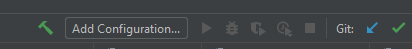
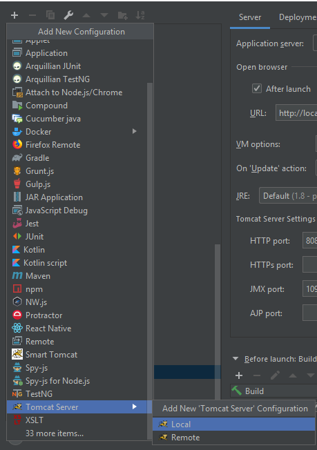
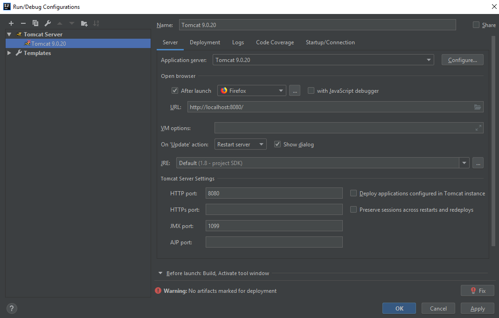
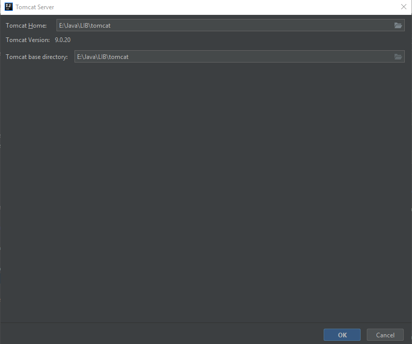
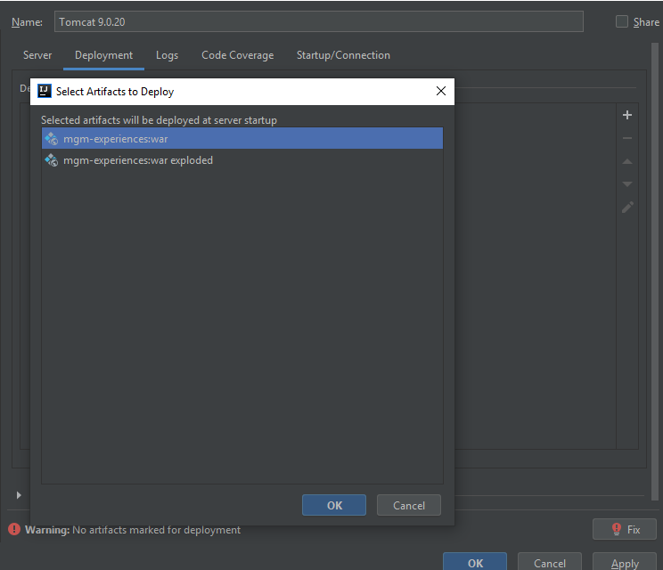
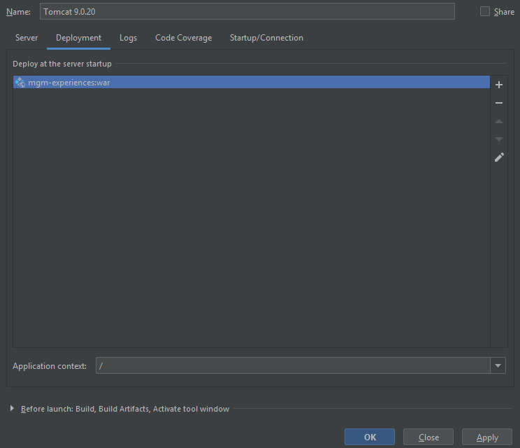
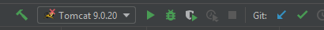

# MGM Experiences


## Build


### Prerequisites

* Maven
* [PostgreSQL](https://www.postgresql.org/) installed locally or on docker (instruction down below)
* [OpenLDAP Sever](https://www.openldap.org/) installed locally or on docker (instruction down below)

### [PostgresSQL on Docker](https://hub.docker.com/_/postgres)
#### Pull the image

```
 docker pull postgres:{tag}
```

*    **\{tag\}**: [The image tag/version](https://hub.docker.com/_/postgres#supported-tags-and-respective-dockerfile-links). Eg: *latest*, *11*,...

#### Start the container

```
docker run --name {container_name} -e POSTGRES_USER={POSTGRES_USER} -e POSTGRES_PASSWORD={POSTGRES_PASSWORD} -e POSTGRES_DB={POSTGRES_DB} -p {port}:5432 -d postgres
```

*    **\{container_name\}**: The name for the container you want to create.
*    **\{port\}**: Your local port you wish to use for Postgres.
*    **{POSTGRES_USER}**: Set the name of the default PostgreSQL superuser
*    **{POSTGRES_PASSWORD}**: Set default password for the user above
*    **{POSTGRES_DB}**: Set the name of the default PostgreSQL database
     
### [OpenLDAP on docker](https://hub.docker.com/r/osixia/openldap)
#### Pull the image
```html
docker pull osixia/openldap:{tag}
```

*    **\{tag\}**: [The image tag/version](https://hub.docker.com/r/osixia/openldap/tags). Eg: *latest*, *1.2.4*,...


#### Start the container
```html
docker run --name {container_name}
            -p {port}:389 
            -e LDAP_DOMAIN={DOMAIN_NAME} 
            -e LDAP_ADMIN_PASSWORD={PASSWORD} 
            -v {PATH_CONTAIN_SEED_LDAP_FILE}:/container/service/slapd/assets/config/bootstrap/ldif/custom 
            -d osixia/openldap --copy-service
```

*    **\{container_name\}**: The name for the container you want to create.
*    **\{port\}**: Your local port you wish to use for OpenLDAP.
*    **{DOMAIN_NAME}**: Set the your domain name.
*    **{PASSWORD}**: Set default password to access to OpenLDAP.    
*    **{PATH_CONTAIN_SEED_LDAP_FILE}**: Set path contain ldif file. You can find ldap-test.ldif in src/main/resources.  

Example:
```html
docker run --name openldap -p 389:389 -e LDAP_DOMAIN="mgmgo.com" -e LDAP_ADMIN_PASSWORD="mgm123"  -v ~/Desktop/ldif:/container/service/slapd/assets/config/bootstrap/ldif/custom  -d osixia/openldap --copy-service
```
<u>**Note**</u>: In the above example, I copy file ldap-test.ldif to path ~/Desktop/ldif.
    

### Clone git

```
git clone https://bitbucket.mgm-tp.com/scm/exp/main.git
cd main
```

### Steps

*    Edit SQL configurations appropriately to your environment ( *.properties* files in *src\\main\\resources* ):
```
src\main\resources\dbschema\liquibase-dev.properties
src\main\resources\dbschema\liquibase-prod.properties
src\main\resources\application.properties
```

*    In file **application.properties**, we have some properties of LDAP Server, we can change like this:
```html
ldap.urls= ldap://localhost:389/
ldap.base.dn= dc=mgmgo,dc=com
ldap.username= cn=admin,dc=mgmgo,dc=com
ldap.password= mgm123
ldap.user.dn.patterns = uid={0},ou=user
```
*    Generate/update tables with Liquibase if necessary:

For development:

```
mvn liquibase:update -P development
```

For production:

```
mvn liquibase:update -P production
```

*    Build:

```
mvm clean install
```

## Run/Debug locally

### Prerequisites


* Intellij IDEA Ultimate
* [Tomcat](https://tomcat.apache.org/) downloaded and extracted

### Configuration
* At the top right corner of the IDE, click **Add Configuration**.



* Click the **Plus (+)** and choose **Tomcat Server** > **Local**



* Click **Configure...**



* Set **Tomcat Home** to your extracted tomcat directory then click **OK**.



* Choose **Deployment** tab then click the **Plus (+)** and choose the **mgm-experiences:war**.



* Set **Application context** to decide the pathing of the URL. For example, here we set **'/'** which means ROOT. 



* Adjust any other options as you see fit.

* Click **OK** to finished the configuration.

### Run/Debug



Make sure the drop-down list has been set correctly to the configuration you just created.

Click the button to perform the action accordingly.

